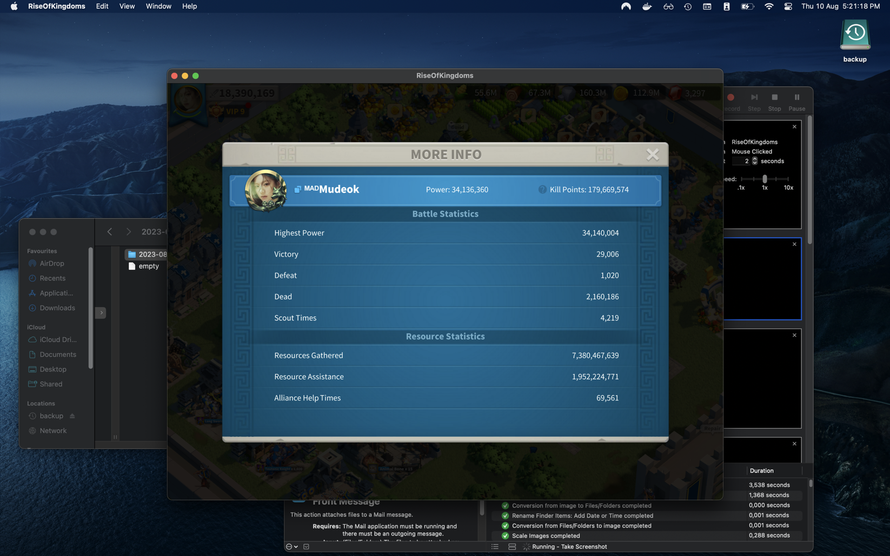

# Rise of Kingdoms - Data Collector

**It allows to extract data from screenshots - *screenshots that you have to take yourself from the game*.**

It is possible and I recommend that you use some *macros/tools/softwares* to do the screenshots automatically. You can do it manually but it can be time consuming hahaha.

> For example, I am using MacOS and I use the Automator.app to automate screenshots captures. You may have some useful tools on Windows too.


## 1. Requirements

- [Tesseract](https://tesseract-ocr.github.io/tessdoc/#compiling-and-installation)
- Python3
- virtualenv

## 2. Installation

```
git clone git@github.com:sovanna/rok-data-collector.git
```
```
cd rok-data-collector/
```
```
virtualenv .venv
```
```
source .venv/bin/activate
```
```
pip install -r requirements.txt
```

## 3. How the program works

### a. First, take screenshots from the game.

- Start with the **MORE INFO** view



- Then with the **GOVERNOR PROFILE** view and the **Kill Statistics** open


#### **Do this for all the governors you need, hence the automate tool to take screenshots**

### b. Put all screenshots taken inside the `screenshots` folder.

### c. Define coordinates for data areas you want to collect

**Check the `template.json` file, update it for your need. It should be self-explanatory.**

Basically, you need to determine a set of coordinates that consist of a rectangle around the data you want to collect:
- position X
- position Y
- width
- height
- is_number can be `false` or `true`, refers to the type of data

```
{
    "x": 562,
    "y": 332,
    "width": 222,
    "height": 37,
    "is_number": false,
    "key": "name"
}
```

**You can use Photoshop or others. You can draw a rectangle selection and find with the info window the coordinates you need**

---
Below an example of a custom tool that I use for this.


**Once your template.json is set, you won't need to update it unless the Game UI changes**

## 4. Collect Data

>When your `template.json` and your `screenshots` are done, you can start the program to collect all data.

Open a Terminal,

```
cd rok-data-collector/
```
```
virtualenv .venv
```
```
source .venv/bin/activate
```
```
python main.py collect --using template.json --from-folder screenshots
```

**3 excel files (*.xlsx) will be created at the end with all your data collected.**

*Note: If the program can't extract some data, it will mark "ERROR". You can look for "ERROR" in Excel to correct manually if needed.*

# 🥳 Day to Day Data Collections 🤩

When you have everything set, you will only:
- **launch your automate tool to take screenshots** (take a rest)
- **launch the program (take a rest)**
- correct "ERROR" if any in the excel (*.xlsx) file (optional)
- open the *.xlsx file, copy/paste in Google Sheets for example

*There is almost no manual work*

# Note

When you collect new data, the excel file will use the order defined by your screenshots.
However, in your Google Sheets Document, you may have already some previous data and you may want to keep the same order.

For example, in Google Sheets Document, you have something like:

| ID        | NAME       | ...       |
|-----------|------------|-----------|
| 123456789 | Governor1  | ...       |
| 010303445 | Governor2  | ...       |
| 383474573 | Governor3  | ...       |

But the ouput excel file will give you:

| ID        | NAME       | ...       |
|-----------|------------|-----------|
| 010303445 | Governor2  | ...       |
| 383474573 | Governor3  | ...       |
| 123456789 | Governor1  | ...       |

Thus, you can't copy/past new data to your Google Sheets document.

### **To prevent that, the program can match the old data order with the new one!**
Just export / download a csv file fron your Google Sheets Document and past it in the old folder and rename the file to `export.csv`